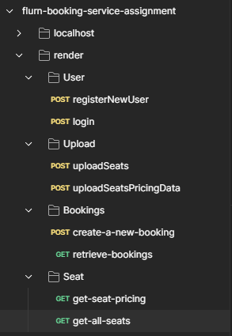

# Flurn Booking Service Assignment



## Objective

Build a Booking Service which allows users to choose seats and book.

## Assignment Specs:

- A list of seats and the seat class will be provided. Every seat class will have
  associated pricing with it. Pricing will be in the format of min price, max price and
  normal price.
- During the booking process when Seat is selected we should retrieve the pricing
  for that seat based on the number of bookings that have already happened for
  that seat class. If the seats in that particular class that was chosen are 60% full,
  then use the max price for all further seats booked. If the seats in the particular
- class that was chosen are 40% to 60% full, then use the normal price for the seat
  booking. If the seats of the particular class that was chosen for less than 40% then
  choose the min price.
- If there is no price available for that range, choose the next available price. Ex. If a
  seat class is only 30% full, but there is no min_pice for that class, use the
  normal_price.

## APIs to be build

### Get All Seats

GET /seats
Return all the seats, ordered by the seat class and also return a boolean is_booked
for every seat.

### Get Seat pricing

GET /seats/id

- Return the seat details along with the pricing for the seat based on the class.
  Note: The pricing should be returned based on the bookings previously made for
  that seat class.
  - Less than 40% of seats booked - use the min_price, if min_price is not
    available, use normal_price
  - 40% - 60% of seats booked - use the normal_price, if normal_price not
    available, use max_price
  - More than 60% of seats booked - use the max_price, if max_price is not
    available, use normal_price

## Create Booking

POST /booking

- Create a booking for the selected seats.
- Accept an array of seat ids to be booked, name and phone number of the user.
- Create a booking if those seats are not previously booked. Return relevant error
- message if any seats chosen are already booked.
- Upon successful booking, return the booking ID, and the total amount of the
  booking.

# Retrieve Bookings

GET /bookings?userIdentifier=<email or phone number>

- Return all bookings created by the user. The API should search by email or phone
  number. Any one has to be provided. Return error if no user identifier is provided.

# Bonus features

1. Notification Integration: Send out booking confirmation notification (Email
   or SMS) when the booking is created. You can use third-party service
   providers like Twilio, Sendgrid, Textlocal etc.
2. Write a script to upload the default data to your database by reading the
   CSV file.

## How to install and run in yours local machine

```bash
npm install
npm run start
```

## Tech. Stack Used:

- [MongoDB](https://www.mongodb.com/)
- [ExpressJS](https://expressjs.com/)
- [ReactJS](https://react.dev/)
- [NodeJS](https://nodejs.org/en/)

## Author

[Abhishek kumar](https://www.linkedin.com/in/alex21c/), ([Geekster](https://geekster.in/) MERN Stack FS-14 Batch)
